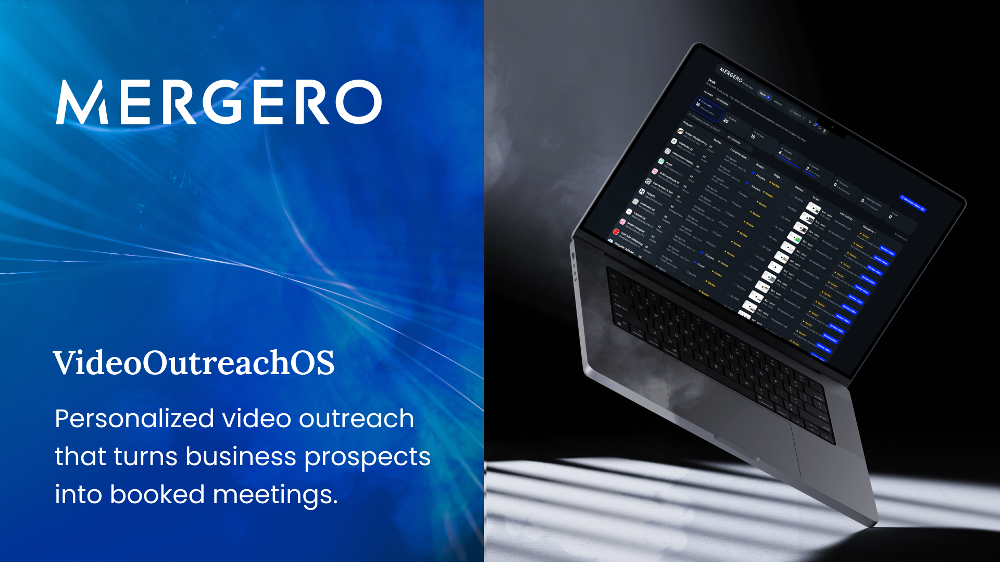

# VideoOutreachOS

The Mergero video tool makes a personalized video for the owner of a company in the Mergero Pipedrive pipeline. The owner gets a link. The link opens a page with the video, a valuation calculator and a button that books a Teams meeting with the analyst.

The tool records the engagement and moves the company through the Pipedrive pipeline. It also makes follow-up tasks and writes a meeting brief before each meeting.

The PRD.md file holds the requirements. The `.planning/` folder holds the design notes. The `.planning/architecture.md` file is the contract for the code.

## Repository layout

| Folder | Contents |
|---|---|
| `apps/server` | Hono API and worker (1 package, 2 entry points) |
| `apps/web` | Vite app for the admin panel and the video page |
| `apps/mgx-mock` | MGX MCP server mock and buyer logos |
| `packages/shared` | types, zod schemas, pure logic, i18n |
| `packages/scene` | Revideo scene and render |
| `scripts` | Pipedrive setup and seed |
| `config` | Pipedrive field and stage IDs, Mergero facts and brand |
| `seed` | demo data for the fake providers |
| `e2e` | Playwright tests |

## Requirements

- Node.js 24 or later
  - The code uses native type stripping.
- pnpm 10
- ffmpeg and ffprobe 8
- Google Chrome or Chrome for Testing
  - Revideo needs H.264 in WebCodecs. Open-source Chromium does not work.

## Start the demo

```sh
pnpm install
cp .env.example .env
pnpm dev
```

Open http://localhost:3000. The command starts four processes:

| Process | Address | Job |
|---|---|---|
| API | http://localhost:3000 | admin panel, video page, media, mock Asiakastieto |
| Worker | none | scrape, scripts, audio, render, Pipedrive writes, hourly sweep, backup |
| Mock MGX | http://localhost:3100 | MCP server, buyer logos |
| Vite | http://localhost:5173 | front end modules in development |

Without API keys, each external service uses a local fake. The avatar in the top bar then shows an amber dot, and the avatar menu lists the "Demo providers":

| Service | Key | Fake |
|---|---|---|
| Pipedrive | `PIPEDRIVE_API_TOKEN`, `PIPEDRIVE_COMPANY_DOMAIN` | JSON store copied from `seed/pipedrive.json` |
| Firecrawl | `FIRECRAWL_API_KEY` | local Chrome scraper |
| Featherless (Kimi-K3) | `FEATHERLESS_API_KEY` | template writer |
| ElevenLabs | `ELEVENLABS_API_KEY` | macOS `say`, else silence |

The companies in `seed/pipedrive.json` are real companies with public websites, so the scrapers can read them. The seed file has no figures for these companies. Slide 4 asks the owner to enter the figures. The email addresses use the reserved domain `example.com`, so that no message goes to a real person.

For local tests without a face-cam intro or a voice clone, set `DEV_BYPASS=1`. Then an analyst without an intro gets a 3 s placeholder clip, and an analyst without a voice clone gets the macOS `say` voice. The worker makes the clip at start and moves the blocked deals forward. The bypass has no effect when `NODE_ENV` is `production`.

## Make a first video

1. Select an analyst in the top bar.
2. Open the profile menu. Record the face-cam intro and its transcript in each language that you use. Upload a voice sample and the signed consent.
3. Open a deal: http://localhost:3000/deals/4001. The Video field in Pipedrive opens the same address.
4. Wait until the deal is in the Review stage. Check the scripts and the slides, then select "Approve and publish".
5. Copy the link for a channel from the deal page.

| Deal | Country | Video language |
|---|---|---|
| 4001 | Finland | Finnish |
| 4002 | Finland | Swedish |
| 4003 | Finland | Finnish |
| 4004 | Sweden | Swedish |
| 4005 | Norway | Norwegian |
| 4006 | Denmark | Danish |
| 4007 | Germany | German |
| 4008 | Austria | German |
| 4009 | Switzerland | German |
| 4010 | Iceland | English |

## Deal stages

A deal moves forward through these stages. It does not move back.

1. **Draft**: the worker scrapes the website, writes the scripts, makes the audio and renders the video.
2. **Review**: the analyst checks the scripts and the slides.
3. **Link sent**: the analyst publishes the video, and the link is live.
4. **Opened**: the owner opens the link.
5. **Form sent**: the owner sends the form.
6. **Meeting booked**: the owner books a meeting. The tool closes the open follow-up tasks for the deal.

A deal goes to **Failed** when a worker job fails. If the owner selects "not interested" in the form, the deal goes to **Lost**. The tool then sets the deal to lost in Pipedrive, with the reason. The tool also follows each won, lost and reopened deal in Pipedrive.

## Connect a real Pipedrive account

Run `pnpm setup:pipedrive`. The script does these steps:

- It makes the custom fields and the stages in Pipedrive.
- It writes the `config/pipedrive.json` file.
- It fills the Video field.

Run `pnpm seed:pipedrive` to copy the demo companies, persons and deals into your Pipedrive account. This step is optional.

The API reads the Pipedrive changes at a 10 s interval while an admin panel is open. With no open panel, it uses a 60 s interval. When less than 20 % of the daily token budget remains, it uses a 120 s interval.

A lost, won or deleted deal in Pipedrive closes the deal in the tool. "Edit contact" on the deal page saves the company and contact data in Pipedrive.

## Production

To build the tool, run `pnpm build`. To start the tool, run `pnpm start`.

Run the tool on a private address only. The admin panel has no sign-in.

## Checks

| Check | Command |
|---|---|
| Type check | `pnpm typecheck` |
| Lint | `pnpm lint` |
| Unit tests | `pnpm test` |
| End-to-end tests (Playwright, mobile Chrome and mobile Safari) | `pnpm e2e` |

Before the first e2e run, install WebKit with `pnpm exec playwright install webkit`. The mobile Chrome tests use the installed Google Chrome.

The e2e run builds the web app. Then it starts its own API, worker and mock MGX on free ports, with the fake providers and a temporary folder. It uploads an intro, a voice sample and a consent. Then it renders and publishes 3 demo deals (4001, 4007 and 4009) before the tests start.

This setup takes some minutes. To keep the temporary folder and its logs after the run, set `MERGERO_E2E_KEEP=1`.

## Data

All state is in the `storage/` folder: the SQLite database (in WAL mode) and the media files. Each hour, the sweep deletes the media, the sessions, the events and the meeting briefs of each expired link. Each day, the tool writes a backup to `storage/data/backups/` and keeps the last 14 backups.
